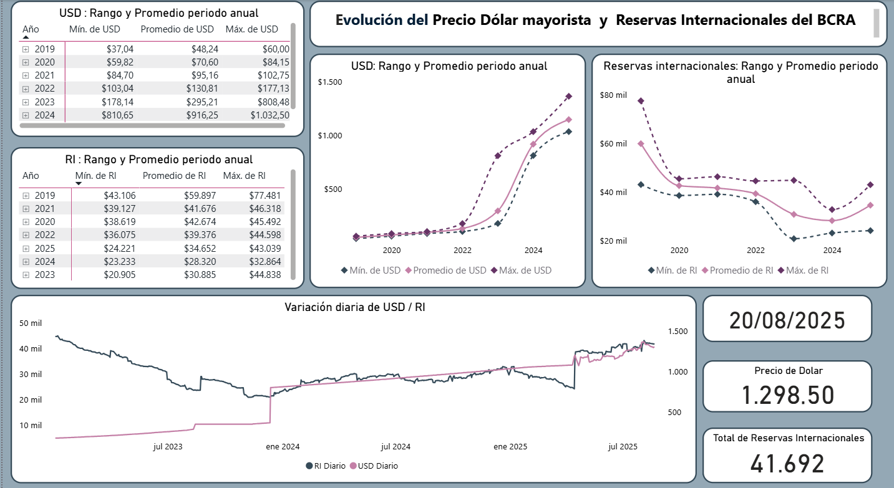
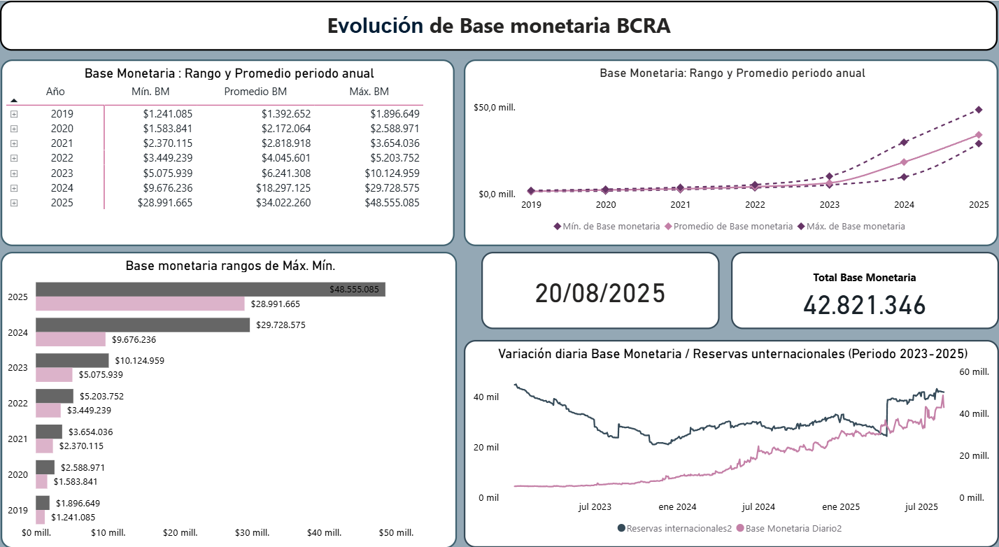

# Análisis de Variables Económicas Argentinas 2012–2025

##  Flujo de trabajo
- Extracción → Limpieza → Análisis → Visualización → Informe

##  Objetivo
Analizar la evolución diaria del tipo de cambio mayorista, reservas internacionales y base monetaria en Argentina desde 2012 hasta agosto de 2025 para evaluar la política monetaria y cambiaria en el tiempo.

##  Fuentes de datos
- Datos oficiales del Banco Central de la República Argentina (BCRA): https://www.bcra.gob.ar/PublicacionesEstadisticas/Principales_variables.asp
- Series diarias: Tipo de cambio oficial, Reservas internacionales, Base monetaria

##  Herramientas utilizadas
- Excel: limpieza, cálculo de tendencias y agregación por períodos
- Excel / Power BI: dashboards interactivos para evolución diaria/anual

##  Gráficos destacados

## Informe completo
Podés ver el informe completo del proyecto en formato PDF:  
[Informe de Variables Económicas](./reports/Informe_Variables_Económicas.pdf)

**Autor:**  
**Matías Costa**  
Data Analyst | Estudiante de Licenciatura en Informática
